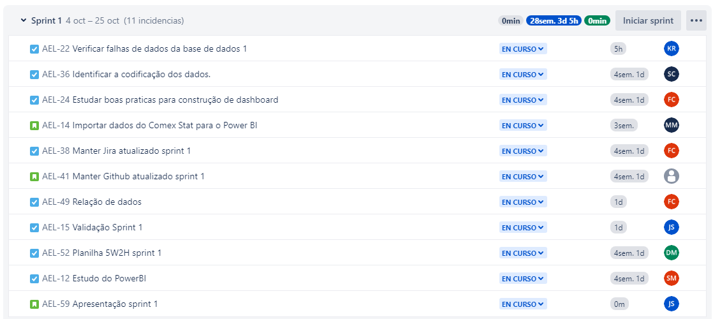

# Dados de Importação e Exportação 
## Aeroporto de São José dos Campos (SJK)

API 4° Semestre - Logística Manhã
  

  

##

### PROJETO
- O projeto aborda o potencial de movimentação de cargas no Aeroporto de São José dos Campos (SJK) através de dados de importações e exportações de municípios. As análise voltadas para os dados de importação e exportação que contribuem as empresas a tomarem decisões mais assertiva sobre a logística de mercado.
### OBJETIVO
- O objetivo desse projeto é criar um sistema de visualização da movimentação de cargas no Aeroporto de São José dos Campos (SJK) por meio de análise de dados de importações e exportações de municípios próximos e relevantes. Através dessa análise de dados, pretendemos atingir oportunidades para expandir e melhorar a capacidade de armazenamento de cargas no Aeroporto de SJK, a fim de atender ás crescentes demandas.
  
### A EQUIPE

  

# Autores
| Função | Nome | LinkedIn & GitHub |
| :-----------: | :------------------------------------ | :-------------------------------------------------------------------------------------------------------------------------------------------------------------------------------------------------------------------------------------------------------------------------------------------------------------------------: |
| Product Owner | Luiz Felipe |    |
| Scrum Master | Diego Moraes |   |
| Team Member | Luiz Gustavo |   |
| Team Member| Simone Rocha |   |
| Team Member | Kassandra Ruiz |   |
| Team Member | Jucineide Maria |   |
| Team Member | Sabrina Tiemi |   |
| Team Member | Mireia Martins |  

### CRONOGRAMA DAS SPRINTS
> Cronograma

Sprint 0 - 18/09/2023 á 04/10/2023
- Jira Backlog
  

 
  
Sprint 1 - 04/10/2023 á 25/10/2023

### DASHBOARD SPRINTS 1

Sprint 2 - 25/10/2023 á 22/11/2023
- Jira Backlog

### 22/11/2023
- Sprint Final

  Jira Backlog

  

  

  - Power BI Exportações

## Video Importação e Exportação

https://github.com/GRUPO4LOG4/PROJETO/assets/129226911/a22a01cf-9ab5-42e8-bebd-dd9909f42a3e

